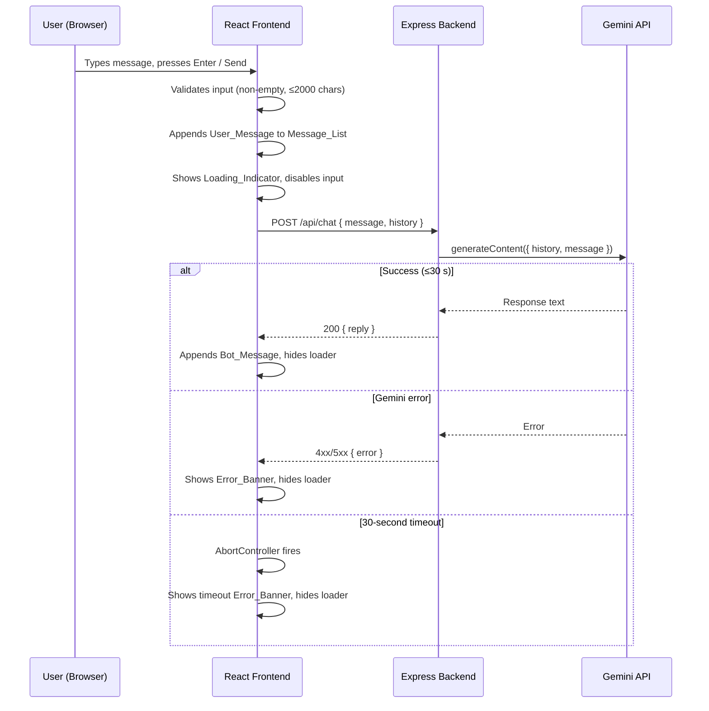
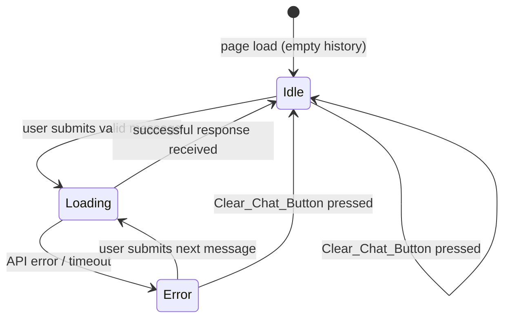

# Design Document — gemini-chatbot

## Overview

The gemini-chatbot is a minimal, beginner-friendly ChatGPT-style web application. A React frontend renders a chat UI in the browser; a Node.js/Express backend acts as a secure proxy to the Google Gemini API. Conversation history lives in React state for the duration of the browser session and is reset on page reload or by an explicit clear action. There is no database, no authentication, and no external infrastructure beyond the two local processes.

**Technology choices**

| Layer | Technology | Rationale |
|-------|-----------|-----------|
| Frontend | React (Vite) | Fast dev server, minimal config, modern default |
| Backend | Node.js + Express | Familiar, minimal boilerplate, beginner-friendly |
| Gemini integration | `@google/generative-ai` SDK | Official Google SDK, well-documented |
| Styling | Plain CSS (CSS Modules) | No extra dependency, easy to understand |
| Environment | `dotenv` on the backend | Standard env-variable management |

---

## Architecture

The system is two local processes connected by HTTP.

```
Browser (React app)
        │
        │  POST /api/chat  (JSON: { message, history })
        ▼
Express Server (Node.js)
        │
        │  @google/generative-ai SDK call
        ▼
Gemini API (external)
```

### Request / response flow



### Repository layout

```
chatbot-app/
├── client/                  # React (Vite) frontend
│   ├── src/
│   │   ├── components/
│   │   │   ├── ChatWindow.jsx       # Message_List container
│   │   │   ├── MessageBubble.jsx    # Single User_Message or Bot_Message
│   │   │   ├── MessageInput.jsx     # Auto-resize textarea + Send_Button
│   │   │   ├── LoadingIndicator.jsx # Animated typing dots
│   │   │   └── ErrorBanner.jsx      # Non-blocking error display
│   │   ├── hooks/
│   │   │   └── useAutoResize.js     # textarea scrollHeight hook
│   │   ├── api/
│   │   │   └── chatApi.js           # fetch wrapper with AbortController
│   │   ├── App.jsx                  # Root: state, handlers, layout
│   │   └── main.jsx                 # Vite entry point
│   ├── index.html
│   └── vite.config.js               # proxy /api → localhost:3001
├── server/
│   ├── index.js                     # Express entry, env validation, routes
│   ├── routes/
│   │   └── chat.js                  # POST /api/chat handler
│   ├── services/
│   │   └── geminiClient.js          # @google/generative-ai wrapper
│   └── .env                         # GEMINI_API_KEY (git-ignored)
├── .gitignore
└── README.md
```

---

## Components and Interfaces

### Frontend components

#### `App.jsx`

Root component. Owns all shared state and passes props/callbacks down.

```
State:
  messages:     Message[]     — ordered list of chat turns (UI display)
  history:      HistoryEntry[] — context sent to the backend (up to 100)
  isLoading:    boolean        — true while awaiting API response
  errorMessage: string | null  — current error text, null when hidden

Callbacks (passed to children):
  handleSend(text: string): void
  handleClear(): void
```

#### `ChatWindow.jsx`

Renders the scrollable `Message_List`. Uses a `ref` on the container to call `scrollTop = scrollHeight` whenever `messages` changes, keeping the latest message visible.

Props: `messages: Message[]`, `isLoading: boolean`

#### `MessageBubble.jsx`

Renders a single chat turn. Visual distinction is achieved via alignment (user = right, bot = left) and a CSS class (`bubble--user` / `bubble--bot`), not by color alone.

Props: `role: 'user' | 'bot'`, `content: string`

#### `MessageInput.jsx`

Contains the auto-resize `<textarea>` and the `Send_Button`. Manages the local `inputText` state. Keyboard handler: `Enter` → submit (unless loading or whitespace-only), `Shift+Enter` → insert newline.

Props: `onSend(text): void`, `isLoading: boolean`

#### `LoadingIndicator.jsx`

Animated three-dot spinner shown inside `ChatWindow` while `isLoading` is true.

#### `ErrorBanner.jsx`

Non-blocking banner rendered above the input row when `errorMessage` is not null.

Props: `message: string | null`

#### `useAutoResize.js` hook

```js
// Usage: const ref = useAutoResize(value, maxLines);
// Effect: resets height to 'auto' then sets height = scrollHeight,
//         capped at (lineHeight * maxLines) px, overflow: scroll beyond cap.
```

#### `chatApi.js`

```js
export async function sendMessage(message, history, signal) {
  const response = await fetch('/api/chat', {
    method: 'POST',
    headers: { 'Content-Type': 'application/json' },
    body: JSON.stringify({ message, history }),
    signal,            // AbortController signal for 30-second timeout
  });
  if (!response.ok) {
    const { error } = await response.json();
    throw new Error(error || 'Unknown server error');
  }
  const { reply } = await response.json();
  return reply;
}
```

---

### Backend modules

#### `server/index.js`

Entry point. Validates `GEMINI_API_KEY` at startup and refuses to continue if absent. Registers the `/api/chat` route.

```js
const key = process.env.GEMINI_API_KEY;
if (!key) {
  console.error('Missing required environment variable: GEMINI_API_KEY');
  process.exit(1);
}
```

#### `server/routes/chat.js`

Handles `POST /api/chat`. Validates request body, delegates to `geminiClient`, and maps errors to HTTP responses.

```
Input:  { message: string, history: HistoryEntry[] }
Output: { reply: string }          — 200 OK
        { error: string }          — 400 Bad Request (invalid input)
        { error: string }          — 502 Bad Gateway (Gemini API error)
        { error: 'Internal server error' } — 500 (unhandled exception)
```

#### `server/services/geminiClient.js`

Wraps the `@google/generative-ai` SDK. Converts the frontend `HistoryEntry[]` into the SDK's `Content[]` format and calls `generateContent`.

```js
import { GoogleGenerativeAI } from '@google/generative-ai';

const genAI = new GoogleGenerativeAI(process.env.GEMINI_API_KEY);
const model = genAI.getGenerativeModel({ model: 'gemini-1.5-flash' });

export async function getChatReply(message, history) {
  // history is already in SDK Content format: { role, parts: [{ text }] }
  const chat = model.startChat({ history });
  const result = await chat.sendMessage(message);
  return result.response.text();
}
```

---

### API contract

#### `POST /api/chat`

**Request body**
```json
{
  "message": "What is the capital of France?",
  "history": [
    { "role": "user",  "parts": [{ "text": "Hello" }] },
    { "role": "model", "parts": [{ "text": "Hi! How can I help?" }] }
  ]
}
```

**Success response — 200**
```json
{ "reply": "The capital of France is Paris." }
```

**Error response — 4xx / 5xx**
```json
{ "error": "Human-readable description of the failure." }
```

---

## Data Models

### `Message` (frontend display)

Each entry in the `messages` array rendered by `ChatWindow`.

```ts
interface Message {
  id:      string;   // crypto.randomUUID() — used as React key
  role:    'user' | 'bot';
  content: string;
}
```

### `HistoryEntry` (Gemini SDK format)

Sent in the request body and passed directly to `model.startChat({ history })`.

```ts
interface Part {
  text: string;
}

interface HistoryEntry {
  role:  'user' | 'model';   // NOTE: Gemini SDK uses 'model', not 'bot'
  parts: Part[];
}
```

> The `role` value in `HistoryEntry` must be `'model'` (not `'bot'`) to match the Gemini API contract. The frontend converts bot turns from `'bot'` → `'model'` when building the history array.

### Session history management

```
messages array (UI):    Message[]       — role: 'user' | 'bot'
history array (API):    HistoryEntry[]  — role: 'user' | 'model'

Capacity: 100 entries maximum.
Eviction:  When the 100-entry limit is reached, the oldest entry is removed
           before the new User_Message is appended. The Bot_Message is then
           appended afterward, so a full history always ends with a model turn.
```

### State transitions



---

## Correctness Properties

*A property is a characteristic or behavior that should hold true across all valid executions of a system — essentially, a formal statement about what the system should do. Properties serve as the bridge between human-readable specifications and machine-verifiable correctness guarantees.*

### Property 1: Valid message grows the message list

*For any* non-empty, non-whitespace-only message string of at most 2000 characters, submitting it should increase the length of the `messages` array by exactly one, with the new entry having `role = 'user'` and `content` equal to the submitted text — and the `MessageInput` value should be the empty string afterward.

**Validates: Requirements 1.1, 2.1**

---

### Property 2: Whitespace-only input is rejected and input is preserved

*For any* string composed entirely of whitespace characters (spaces, tabs, newlines, or any combination), attempting to submit it should leave the `messages` array unchanged, not trigger any API call, and leave the `MessageInput` value unchanged.

**Validates: Requirements 1.1, 2.4**

---

### Property 3: Shift+Enter inserts newline without submitting

*For any* string currently in the `MessageInput`, pressing Shift+Enter should append a newline character to the value and not cause any entry to be added to the `messages` array.

**Validates: Requirements 2.2**

---

### Property 4: History is forwarded correctly with role mapping

*For any* sequence of valid user/bot message pairs accumulated during a session, the `history` payload sent in the request body should contain the same entries in the same chronological order, with each `'bot'` UI role mapped to `'model'` and each `parts[0].text` equal to the corresponding `content` value.

**Validates: Requirements 3.1, 3.2, 3.3**

---

### Property 5: History eviction preserves the 100-entry cap

*For any* sequence of messages that causes the history to reach 100 entries, adding one more user/bot pair should produce a history array of at most 100 entries — the oldest entry is removed before the new one is appended, so the cap is never exceeded.

**Validates: Requirements 3.5**

---

### Property 6: Clear resets both display and history

*For any* non-empty `messages` array and `history` array, activating the Clear_Chat_Button should produce an empty `messages` array (length 0) and an empty `history` array (length 0), regardless of the content or number of prior turns.

**Validates: Requirements 4.2**

---

### Property 7: Errors show a banner, suppress bot messages, and preserve input

*For any* message string in the `MessageInput` when an API error or network failure occurs, the result should be: (a) an `Error_Banner` is shown with a non-empty description, (b) no Bot_Message is appended to the `messages` array, and (c) the `MessageInput` value equals the original string — the user can retry without retyping.

**Validates: Requirements 5.2, 5.3, 5.6**

---

### Property 8: API key is never present in any outbound request or response

*For any* message submitted from the frontend, the API key value should not appear in any request header, request body, or response body that passes through the HTTP boundary — neither the frontend fetch call nor any backend JSON response should ever carry the raw API key string.

**Validates: Requirements 6.4, 6.5**

---

### Property 9: Message bubble renders role and content correctly

*For any* `Message` object with a non-empty `content` string, the rendered `MessageBubble` should contain the full `content` text verbatim and apply a CSS class that encodes the `role`, with `user` messages aligned right and `bot` messages aligned left, so authorship is distinguishable without relying on color alone.

**Validates: Requirements 7.1**

---

## Error Handling

### Frontend error handling

| Scenario | Behaviour |
|----------|-----------|
| Whitespace-only input | Silently ignored; no API call; input unchanged |
| Input > 2000 chars | Submit button disabled; no API call |
| Network error / non-OK response | `errorMessage` state set with human-readable text; `Error_Banner` shown |
| 30-second timeout | `AbortController.abort()` fires; timeout message shown in `Error_Banner` |
| Successful response after error | `errorMessage` reset to `null`; `Error_Banner` hidden |
| Error during request | `MessageInput` value preserved; user can retry without retyping |

**30-second timeout implementation**
```js
// In handleSend (App.jsx)
const controller = new AbortController();
const timeoutId = setTimeout(() => controller.abort(), 30_000);
try {
  const reply = await sendMessage(text, history, controller.signal);
  // ...
} catch (err) {
  if (err.name === 'AbortError') {
    setErrorMessage('Request timed out. Please try again.');
  } else {
    setErrorMessage(err.message || 'Something went wrong.');
  }
} finally {
  clearTimeout(timeoutId);
  setIsLoading(false);
}
```

### Backend error handling

| Scenario | HTTP status | Response body |
|----------|------------|---------------|
| Missing/empty `message` field | 400 | `{ error: 'message is required' }` |
| Gemini API returns an error | 502 | `{ error: <Gemini error message> }` |
| Unhandled exception | 500 | `{ error: 'Internal server error' }` |

**Unhandled exception middleware** (registered last in `index.js`)
```js
app.use((err, req, res, next) => {
  console.error('[Unhandled]', err);          // full stack to server console
  res.status(500).json({ error: 'Internal server error' });
});
```

The API key is **never** included in any error response or logged in a way that would surface it in HTTP responses.

---

## Testing Strategy

### Unit tests

**Framework:** Vitest + React Testing Library (frontend), Vitest (backend)

Focus areas:
- `chatApi.js` — verify correct `fetch` call shape, error propagation, abort signal handling
- History eviction logic — verify 100-entry cap and oldest-first removal
- Role mapping — verify `'bot'` → `'model'` conversion in history construction
- Input validation — empty string, whitespace-only strings, 2000-char boundary
- `geminiClient.js` — mock the `@google/generative-ai` SDK to verify history passed to `startChat`
- Backend route — mock `geminiClient` to verify HTTP status codes for success/error/unhandled paths
- `ErrorBanner` — renders with a message, hidden when message is null
- `MessageBubble` — correct CSS class and alignment for each role
- Clear handler — verifies `messages` and `history` are both reset to empty arrays

### Property-based tests

**Framework:** `fast-check` (JavaScript PBT library)

Each property test runs a minimum of **100 iterations**.

Tag format in test files: `// Feature: gemini-chatbot, Property {N}: {property_text}`

| Property | Generator strategy |
|----------|--------------------|
| P1 — Valid message grows list + clears input | Generate non-empty, non-whitespace strings ≤2000 chars; assert list grows by 1, new entry matches, input is `''` |
| P2 — Whitespace rejected and input preserved | Generate whitespace-only strings (`fc.constantFrom(' ', '\t', '\n')` + `fc.array`); assert messages unchanged, no fetch call |
| P3 — Shift+Enter inserts newline | Generate arbitrary strings as current input; simulate Shift+Enter; assert `\n` appended, no message appended |
| P4 — History forwarded with role mapping | Generate sequences of user/bot pairs; intercept fetch; assert body `history` matches state history with `'bot'→'model'` |
| P5 — History eviction at 100 entries | Build 100-entry history, add one more pair; assert length ≤ 100 and oldest entry absent |
| P6 — Clear resets both arrays | Generate arbitrary message sequences; click clear; assert `messages.length === 0` and `history.length === 0` |
| P7 — Error shows banner, no bot message, preserves input | Generate arbitrary input strings; mock fetch to reject; assert banner non-empty, no bot in messages, input unchanged |
| P8 — API key absent from requests/responses | Generate arbitrary messages; intercept fetch; assert no request/response string contains API key value |
| P9 — Bubble renders role and content | Generate `Message` objects; render `MessageBubble`; assert content present, correct class applied |

### Integration tests

- `POST /api/chat` with a real Gemini API key (optional, behind a `CI=true` guard)
- Backend startup refusal when `GEMINI_API_KEY` is missing (spawn child process, assert exit code 1)

### What is not tested by PBT

- Loading indicator visibility (snapshot / example test)
- Keyboard focus management (React Testing Library `userEvent`)
- Auto-scroll behavior (example test with a mock `scrollTop`)
- ARIA label presence (React Testing Library `getByRole` / `getByLabelText`)
